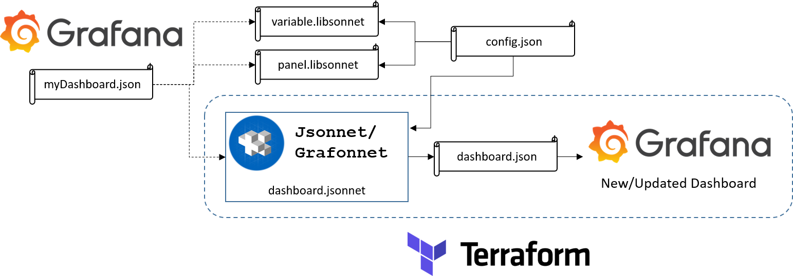

# IoT

## Fonctionnement



## Initialisation du projet

Installer terraform : https://developer.hashicorp.com/terraform/tutorials/aws-get-started/install-cli

Installer golang : https://go.dev/doc/install

Ajouter `PATH=$PATH:~/go/bin:/usr/local/go/bin` au fichier `~/.profile` ou directement taper la commande dans un terminal.

```bash
go install github.com/google/go-jsonnet/cmd/jsonnet@latest
go install -a github.com/jsonnet-bundler/jsonnet-bundler/cmd/jb@latest
```

Dans le dossier du projet :

```bash
jb install github.com/grafana/grafonnet/gen/grafonnet-latest@main
```

## Configuration

Fichier de configuration `config.json` :
```json
{
	"dashboardName": "Generated Dashboard",
	"bucket": "Temperature et qualité d'air",
	"measurements": [
		{ "key": "Temperature", "value": "TempC_SHT", "unit": "celsius" },
		{ "key": "Humidity", "value": "Hum_SHT", "unit": "percent" },
		{ "key": "Air Quality", "value": "Co2_SHT", "unit": "ppm" }
	],
	"variable1Name": "CAMPUS",
	"variable2Name": "Batiment",
	"variable3Name": "ROOM",
	"datasource": "deivf3q0qa1hca",
 
  	"URL": "https://url_to_grafana",
  	"grafana_api_token": "grafana_service_account_token"
}

```

> /!\ Pas de "," à la fin de chaque objet !

### Récupérer un `grafana_api_token` dans Grafana v9

`Grafana > Configuration` puis au choix :
* API Keys > New API key > Role: Editor > Add > Copy
* Service accounts > Add service account > Role: Admin > Add service account token > Copy clipboard

### Récupérer un `grafana_api_token` dans Grafana v11

* `Grafana > Administration > Users and access > Service account > Add service account`
* Role: Admin
* `Create > Add service account token > Generate token > Copy to clipboard`

### Récupérer l'uid d'une datasource

A associer avec la clé `datasource` :
``` bash
curl -u username:password http://url/to/grafana/api/datasources
```

Ou aller dans un dashboard qui utilise déjà la bonne datasource, puis `Share > Export > View JSON` puis chercher l'objet suivant afin de récupérer le bon **uid** :
``` json
"datasource": {
	"type": "influxdb",
	"uid": "deivf3q0qa1hca"
}
```

Les datasources sont visibles ici :
* Grafana v9 : `Grafana > Configurations > Data sources > VotreDatasource`
* Grafana v11 : `Grafana > Connections > Data sources > VotreDatasource`

> Le token est déjà associé à une organisation, username et password. Attention à bien créer ce token depuis la bonne organisation.

## Déploiement

* Aller dans le répertoire `IoT-main`,
* Configurer `config.json`.

Enfin :
```bash
terraform init
terraform plan
terraform apply
```

Terraform s'occupe de générer le dashboard à partir du fichier jsonnet et le pousse automatiquement sur Grafana.

## Organisation des fichiers

```
.
├── README.md
├── config.json
├── dashboards
│   ├── dashboard.jsonnet
│   ├── panels
│   │   └── panel.libsonnet
│   └── variables
│       └── variable.libsonnet
├── jsonnetfile.json
├── jsonnetfile.lock.json
├── main.tf
├── terraform.tfstate
├── terraform.tfstate.backup
├── terraform.tfvars
├── variables.tf
└── vendor...
```

Toutes les informations utiles au dashboard sont dans le répertoire `dashboards`. Le fichier `dashboard.jsonnet` regroupe toutes les configurations relatives au dashboard généré. Les paneaux et les variables sont respectivement stockées dans les bibliothèques `panel.libsonnet` et `variable.libsonnet` : on peut retrouver tous les détails mais aussi les éléments de génération adaptés à la configuration choisie par l'utilisateur.

L'utilisateur n'a qu'un seul fichier à modifier dans lequel il décrit toutes les configurations souhaitées : `config.json`.

Pour adapter un nouveau dashboard modèle, il faut écrire toutes les bibliothèques jsonnet à la main (2 jours pour faire les bibliothèque ici présentes).
